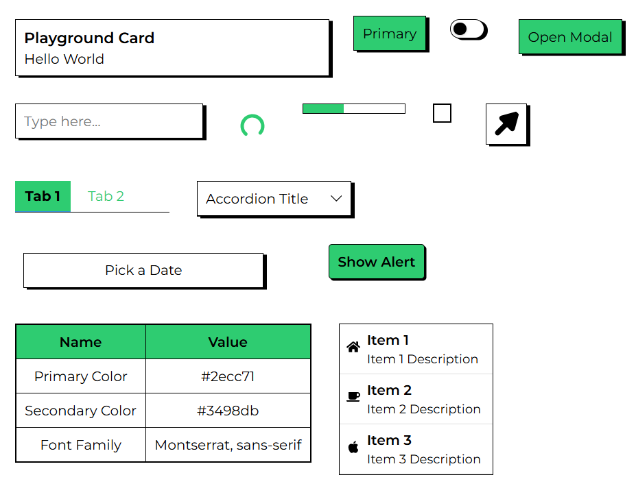
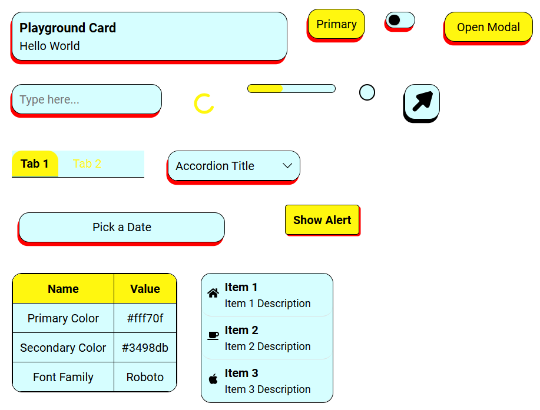

# Tharikida UI 🚀🔥

[](https://www.npmjs.com/package/tharikida-ui)
[](LICENSE)
[](https://www.npmjs.com/package/tharikida-ui)

**A Modern React Component Library for Fast, Flexible, and Themed UIs**

Tharikida UI is a lightweight React component library designed for simplicity, flexibility, and a beautiful user experience. It offers a growing set of accessible, customizable, and themeable components for building professional, modern web applications with ease.

<p align="center">
  
  
</p>

## Why Tharikida UI?

- ✨ **Modern Design:** Clean, minimal, and visually appealing UI components.
- ⚡ **Fast & Lightweight:** Minimal dependencies, optimized for performance.
- 🎨 **Theming Built-In:** Effortlessly customize colors, fonts, and corner radius globally with the `ThemeProvider`.
- 🛠️ **Highly Customizable:** All components support custom styles, theming, and flexible props.
- ♿ **Accessible:** Built with accessibility and usability best practices.
- 📦 **Comprehensive:** Includes Button, Modal, Card, Input, Alert, ProgressBar, List, Table, and more.

---

## Links

- 🌐 [Documentation & Playground](https://tharikida-ui.vercel.app/)
- 🗂️ [GitHub Repository](https://github.com/harinarayanan-kp/tharikida-ui)
- 📦 [NPM Package](https://www.npmjs.com/package/tharikida-ui)

---

## Installation

Install Tharikida UI in your React project:

```bash
npm install tharikida-ui
```

---

## Getting Started

Here's a quick example to get you up and running:

```jsx
import React from "react";
import { ThemeProvider } from "tharikida-ui";
import { Button } from "tharikida-ui/button";

const App = () => (
  <ThemeProvider
    primaryColor="#4caf50"
    secondaryColor="#ff9800"
    fontFamily="'Montserrat', sans-serif"
    cornerRadius={16}
  >
    <h1>Welcome to Tharikida UI!</h1>
    <Button type="primary" onClick={() => alert("Clicked!")}>
      Themed Button
    </Button>
  </ThemeProvider>
);

export default App;
```

---

## Features

- ✨ **Modern Design:** Clean, minimal, and visually appealing UI components.
- ⚡ **Fast & Lightweight:** Optimized for performance with minimal dependencies.
- 🎨 **Theming Built-In:** Change colors, fonts, and corner radius globally with the `ThemeProvider`.
- 🛠️ **Customizable:** All components support custom styles, theming, and flexible props.
- ♿ **Accessible:** Built with accessibility best practices.
- 📦 **Comprehensive:** Includes Button, Modal, Card, Input, Alert, ProgressBar, List, Table, and more.

---

## Playground

Want to experiment with theming and components live? **Visit the Playground on the homepage!** Tweak colors, font, and corner radius, and see instant updates with code samples.

---

## Components

Tharikida UI includes:

- **Button:** Customizable, theme-aware buttons
- **Modal:** Simple modal dialogs
- **Input:** TextInput, CheckBox, RadioButton, DropDown, TextArea, ToggleSwitch
- **Card:** Flexible content containers
- **Alert:** Popup alerts
- **ProgressBar:** Sleek progress indicators
- **List & ListTile:** Structured lists
- **Table:** Themed data tables
- **Snackbar, Tooltip, Loader, and more!**

---

## Customization & Theming

All components support custom styles via props. For global theming, use the `ThemeProvider` to set primary/secondary colors, font, and corner radius. You can also override styles and corner radius per component.

---

## Contributing

Contributions are welcome! If you have suggestions, bug reports, or want to add new components, please open an issue or submit a pull request on [GitHub](https://github.com/harinarayanan-kp/tharikida-ui).

1. Fork the repo
2. Create your feature branch (`git checkout -b feature/YourFeature`)
3. Commit your changes (`git commit -am 'Add new feature'`)
4. Push to the branch (`git push origin feature/YourFeature`)
5. Open a pull request

---

## Tech Stack Compatibility

Tharikida UI is designed to work seamlessly with modern React-based projects, including:

- **React** (v18 and v19)
- **TypeScript**
- **Next.js**
- **Vite**
- **Create React App**
- Any other React framework or build tool supporting ES modules

---

For full documentation and advanced usage, see the docs site or explore the Playground!
